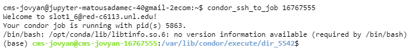

Interfacing With HTCondor Workers
=========
Locating Workers
-----
Dask deploys workers through HTCondor. Information about these workers can be located through the terminal using the ``condor_q`` command. This will display information about all workers which have run on coffea-casa, but you can typically find your workers by approximating their starting time and date. For a more reliable method, you can run the command ``condor_q -af:h Owner JobStartDate JobId DaskSchedulerAddress | grep -E "(username|Owner)"`` where ``username`` is replaced by your coffea-casa username. This username is identical to the name in your terminal command line which follows ``cms-jovyan@jupyter`` (e.g. ``cms-jovyan@jupyter-matousadamec-40gmail-2ecom:~$`` has username matousadamec-40gmail-2ecom).

Accessing Workers
-----
Each of the workers listed after ``condor_q`` is executed has an ID associated with it. This can be found either under the ``BATCH_NAME`` or ``JOBS_ID`` columns, both of which should be identical (up to the decimal). To connect to a specific worker, you can use the ``condor_ssh_to_job ID`` command, replacing ``ID`` with your worker's ID. Upon a successful connection, your terminal should indicate the worker you have connected to. An example of what this looks like is provided below:

   
From here, you can execute terminal commands as usual, but you are now "within" the worker. Of particular interest here will be the log files ``_condor_stderr`` and  ``_condor_stdout``, which will tell you any errors or print statements executed during the worker's runtime. You should also be able to see an ``xcache_token`` if you are wanting to use CMS data (as you should be running on an instance where xcache is enabled).

Killing Workers
-----
To kill a job, go to the scheduler terminal. Find the ID of the job you are seeking to kill through ``condor_q``, and then use ``condom_rm ID`` (replacing ``ID`` with your job's ID). This may be useful if your job becomes stuck during processing.