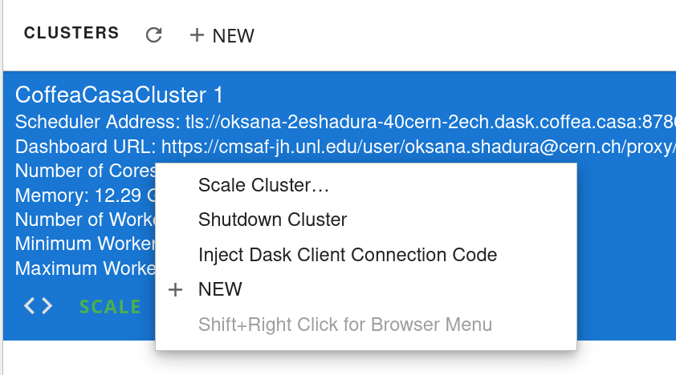

.. _configuration:

.. py:currentmodule:: dask_casa

How to Configure Dask Labextension Cluster
===========================================

The Dask JupyterLab extension package provides a JupyterLab extension to manage Dask clusters, as well as to embed Dask's dashboard plots directly into JupyterLab panes.

The ``~/.config/dask/jobqueue-coffea-casa.yaml`` or ``/etc/dask/jobqueue-coffea-casa.yaml`` files are usually the default configuration files used for :class:`CoffeaCasaCluster`:

Example of a file:

.. code-block:: yaml

    jobqueue:
      coffea-casa:

        # Dask worker options, taken from https://github.com/dask/dask-jobqueue/tree/master/dask_jobqueue
        cores: 4                 # Total number of cores per job
        memory: "6 GiB"                # Total amount of memory per job
        processes: null                # Number of Python processes per jobs
        worker-image: "coffeateam/coffea-casa-analysis:0.xx.xx"

        # Comunication settings
        interface: null             # Network interface to use like eth0 or ib0
        death-timeout: 60           # Number of seconds to wait if a worker can not find a scheduler
        local-directory: null       # Location of fast local storage like /scratch or $TMPDIR
        extra: []

        # HTCondor Resource Manager options
        disk: "5 GiB"          # Amount of disk per worker job
        env-extra: []
        job-extra: {}          # Extra submit attributes
        log-directory: null
        shebang: "#!/usr/bin/env condor_submit -spool"

        # Scheduler options
        scheduler-options: {}
        name: dask-worker

To configure a cluster that is launched using it, you should adjust the Dask configuration file, typically stored at ``~/.config/dask/labextension.yaml`` or ``/etc/dask/labextension.yaml``.

.. code-block:: yaml

    labextension:
      factory:
        module: 'coffea_casa'
        class: 'CoffeaCasaCluster'
        args: []
        kwargs: {}

        default:
          workers: 1
          adapt:
            minimum: 5
            maximum: 10

Users can edit `kwargs: {}` to change a :class:`CoffeaCasaCluster` constructor directly (see more details in :doc:`cc_setup`).

To get an address of scheduler that will be used during client connection, try right-clicking on the cluster in the sidebar:

And then pressing *Inject Dask Client Connection Code*, as is shown in example below:

.. code-block:: python

    from dask.distributed import Client
    client = Client("tls://oksana-2eshadura-40cern-2ech.dask.coffea.casa:8786")
    client

or, more simply:

.. code-block:: python

    from dask.distributed import Client
    client = Client("tls://localhost:8786")
    client
