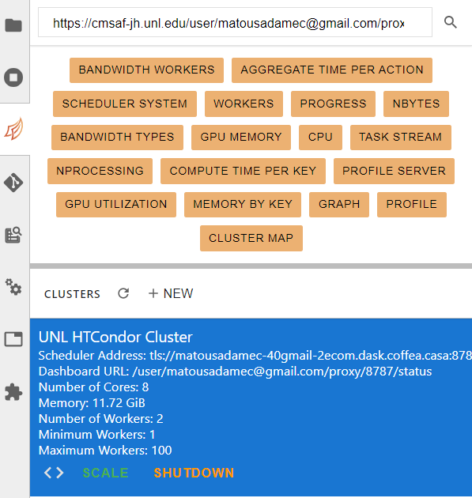
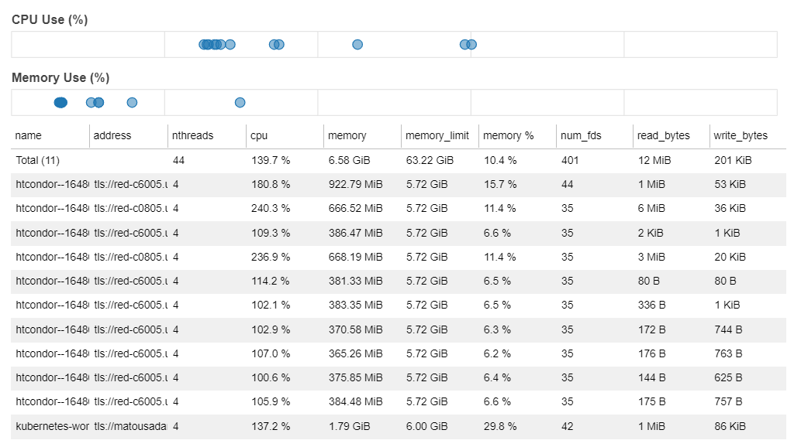
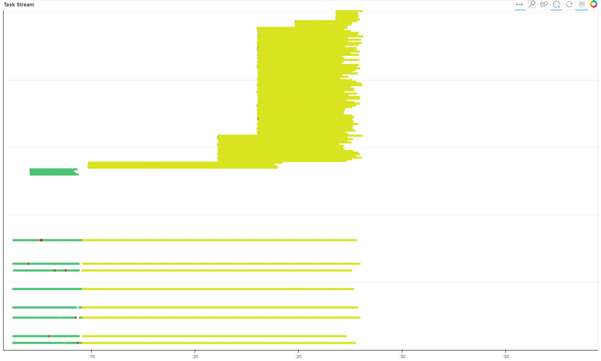
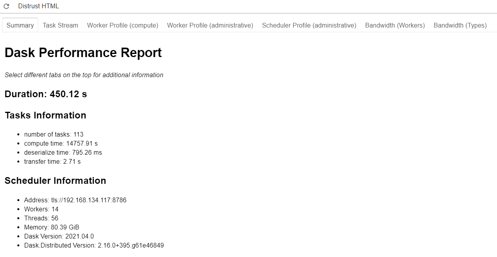

Performance Metrics on Coffea-Casa
=========
Available Features
-----
At some point you will probably want to measure the performance of your analysis on coffea-casa. Luckily, both Dask and coffea come equipped with the capabilities to give you more information about different aspects of your analysis run. These include, broadly:

    - ``run_uproot_job`` has a savemetrics arg which can provide basic info such as the number of entries and the process time
    - the Dask dashboard includes a variety of info, and can be used interactively while your analysis is running
    - the Dask performance report is a snapshot of the Dask dashboard that can be saved for later review

Coffea Metrics
-----
The simplest metrics that can be obtained stem from coffea. They include the number of bytes read, the names of all columns, the number of entries, the processing time (summed across all cores), and the number of chunks. These can be accessed by adding the ``savemetrics: True`` argument to your ``Runner`` function. For example:

.. code-block:: python

    run = processor.Runner(executor=executor,
                            schema=schemas.NanoAODSchema,
                            savemetrics=True)
                            
    output, metrics = run(fileset, "Events", processor_instance=Processor())
                                     
It should be noted that the introduction of this argument changes the format of your ``output`` by converting it into a tuple. Within this tuple, ``output[0]`` will contain everything that ``output`` did without ``savemetrics`` on, while ``output[1]`` will contain the metrics. You can retrieve the "standard" behavior by taking the output of ``run()`` as two variables, as we did above, because Python is capable of parsing tuple outputs into multiple variables.

Dask Interactive Dashboard
-----
The Dask interactive dashboard can be accessed in the same side-pane where your cluster information is displayed. The buttons at the top should be orange when your analysis is running, though they may be grey if the scheduler is inactive or has been shutdown.

   

Among the tabs, you're most likely to find useful information under *workers* and *task stream*. The workers tab gives you information about which workers are running and how many resources each is using:

   
   
The task stream tab gives you information about what each thread is currently working on. This can give insight into, for example, preprocessing versus processing times, the length of an average processing thread, and a visual depiction of anomalies in thread run-time. The graph can look a little intimidating because we typically have a lot of threads:

   
   
Put simply, however, the green parts of the task stream represent the preprocessing step and the yellow parts represent processing. The "verticality" represents the number of threads currently running. Because autoscaling is on, this number varies, with some shutting down (the yellow lines that end short) and some starting up (the new lines stacked at the top).

Dask Performance Report
-----
The Dask performance report is much like the dashboard, though it provides a static snapshot which is generated after a run completes. This snapshot is in the form of an HTML file, which looks something like this when rendered:

It should be noted that the information presented here is somewhat more limited. We don't have access to the nice worker tab, but we do still have access to the task stream. In order to generate a performance report for your analysis, you have to wrap your ``run_uproot_job`` in such a way:

.. code-block:: python

    from dask.distributed import performance_report
    with performance_report(filename="dask-report.html"):
        output = run(fileset, "Events", processor_instance=Processor())
                    
The file will be saved in the working directory, unless you specify a direct path along with the file name.

Suggestions for Improving Performance
-----
With a better understanding of our performance, it's natural to wonder how it could be improved. While autoscaling should pinpoint the ideal number of workers for an analysis run, it could be imperfect, and testing scaling with a manually set amount of workers could be nice check. If disparities between the autoscaling amount and the true ideal amount exist, they should be reported as an issue so that the coffea-casa team try to better optimize the system.

Another factor which can dramatically impact performance is the ``chunksize`` in ``run_uproot_job``. In general, it appears that a lower ``chunksize`` results in quicker runtimes, but there is a lower bound beyond which performance begins to drop. Optimizing ``chunksize`` should be a first stop for addressing performance issues if autoscaling is satisfactory.

Lastly, if you are appealing to regular Python operations within your processor (i.e., not Awkward or NumPy), try to wrap them with `Numba <https://numba.pydata.org/>`_.