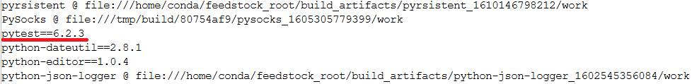

Installing Custom Packages on Coffea-Casa
=========
Coffea-casa provides support for users to install their own packages through pip. In cases where your notebook does not send jobs to workers, you can simply install your packages to the scheduler through the terminal. If you wish for your workers to make use of custom packages, however, you'll need to go through some extra steps to ensure your packages are installed on all workers. Installation to the scheduler is recommended in either case.

Installations on the Scheduler
-----
Let's run through an example: we want to install pytest to our scheduler, and we don't need it to be distributed across our workers. In that case, we can open up a new terminal in coffea-casa by going to the **File** tab and starting a new launcher. A cursory ``pip freeze`` demonstrates that pytest is *not* installed by default, and so we have to add it ourselves. We can do this through ``pip install pytest``, which will tell us that the package is being installed into ``/opt/conda/lib/python3.8/site-packages``. A follow-up ``pip freeze`` indicates that pytest is now in our list of packages:

   
More complicated pip installations are also available. Refer to the `pip install docs <https://pip.pypa.io/en/stable/cli/pip_install/>`_ for more information.

Installations on the Workers
-----
If you install a package to your scheduler but attempt to run it on your workers, you will quickly run into ``ModuleNotFound`` errors. This is because your workers don't have the package! Luckily, a remedy to this problem is fairly simple. Again, let's assume that we wish to install pytest and that this time we wish to use it during processing on our workers. We first get it onto our scheduler (as above), and then we tell our workers to install it:

.. code-block:: python

    from dask.distributed import Client, PipInstall

    dependencies = [
        "pytest",
    ]
    client = Client("tls://localhost:8786")
    client.register_worker_plugin(PipInstall(packages=dependencies))
    
To use this code for your own purposes, you merely have to put in your dependencies in the ``dependencies`` list. This should support all installation formats that pip does, and you can add multiple packages by expanding the list. For example, to install a second package from a GitHub repository, you could specify:

.. code-block:: python

    dependencies = [
        "pytest",
        "topcoffea@git+https://github.com/TopEFT/topcoffea.git",
    ]
    
and your workers should have both pytest and topcoffea installed onto them.

Sending Files to Workers (Without Pip)
-----
If you have a file that you wish to import without pip, and you need to send it to your workers, then you can do so by initializing your client and providing it the following line:

.. code-block:: python

    client.upload_file('foo.py')
    
Where ``foo.py`` is replaced by the file you are attempting to import.
