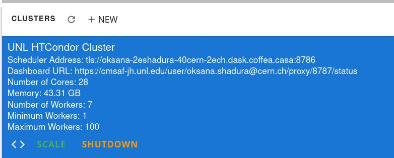

.. _setup:

.. py:currentmodule:: coffea_casa

Coffea-Casa Setup Without Dask Labextention
============

Preparations
-----------

Please shut down ``UNL HTCondor Cluster`` (powered by Dask Labextention and available by default), by pushing the button labeled ``Shutdown``:

Instantiating Your Own CoffeaCasaCluster
-----------

The next snippet will set up a cluster by instantiating a Dask Client with :class:`CoffeaCasaCluster`, scaled to use 10 jobs:

.. code-block:: python

    from distributed import Client
    from coffea_casa import CoffeaCasaCluster

    cluster = CoffeaCasaCluster()
    cluster.scale(10)
    client = Client(cluster)

You can use an adaptive mechanism for Dask job autoscaling. This will scale Dask workers automatically based on scheduler activity:

.. code-block:: python

    from distributed import Client
    from coffea_casa import CoffeaCasaCluster

    cluster = CoffeaCasaCluster()
    cluster.adapt(minimum=4, maximum=10)
    client = Client(cluster)

.. note::

   Don't forget to shutdown your ``Coffea-casa`` cluster before starting a new one:

   .. code-block:: python

       cluster.close()

CoffeaCasaCluster
--------------

The default :class:`CoffeaCasaCluster` constructor settings:

.. code-block:: python

  {
  'protocol': 'tls://',
  'security': Security(require_encryption=True,
                      tls_ca_file='/etc/cmsaf-secrets/ca.pem',
                      tls_client_cert='/etc/cmsaf-secrets/hostcert.pem',
                      tls_client_key='/etc/cmsaf-secrets/hostcert.pem',
                      tls_scheduler_cert='/etc/cmsaf-secrets/hostcert.pem',
                      tls_scheduler_key='/etc/cmsaf-secrets/hostcert.pem',
                      tls_worker_cert='/etc/cmsaf-secrets/hostcert.pem',
                      tls_worker_key='/etc/cmsaf-secrets/hostcert.pem'),
  'log_directory': 'logs',
  'silence_logs': 'DEBUG',
  'scheduler_options': {'port': 8786,
  'dashboard_address': '8787',
  'protocol': 'tls',
  'external_address': 'tls://oksana-2eshadura-40cern-2ech.dask.coffea.casa:8786'},
  'job_extra': {'universe': 'docker',
                'docker_image': 'coffeateam/coffea-casa-analysis:0.2.23',
                'container_service_names': 'dask',
                'dask_container_port': 8786,
                'transfer_input_files': '/etc/cmsaf-secrets/ca.pem, /etc/cmsaf-secrets/hostcert.pem, /etc/cmsaf-secrets/xcache_token',
                'encrypt_input_files': '/etc/cmsaf-secrets/ca.pem, /etc/cmsaf-secrets/hostcert.pem, /etc/cmsaf-secrets/xcache_token',
                'transfer_output_files': '',
                'when_to_transfer_output': 'ON_EXIT',
                'should_transfer_files': 'YES',
                'Stream_Output': 'False',
                'Stream_Error': 'False',
                '+DaskSchedulerAddress': '"tls://oksana-2eshadura-40cern-2ech.dask.coffea.casa:8786"'}}

which you can easily adjust just passing appropriate arguments to CoffeaCasaCluster constructor:

.. code-block:: python

    cluster = CoffeaCasaCluster(cores=1, memory="10 GiB")

or

.. code-block:: python

    cluster = CoffeaCasaCluster(job_extra = {'docker_image': 'coffeateam/coffea-casa-analysis:latest')

.. note::

    ``Coffea-casa`` is using communication through the TLS protocol. You will not be able to disable TLS!

To learn how to use Dask Labextention, please check :doc:`cc_configuration`.
