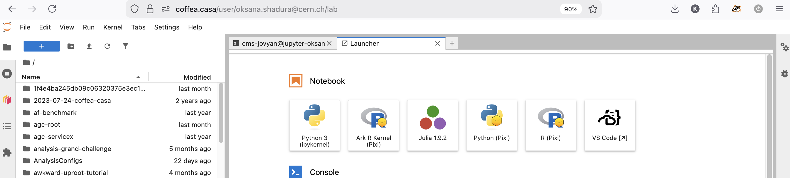
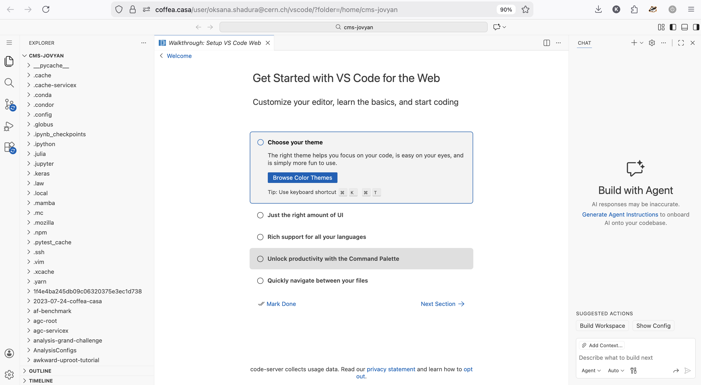

VS Code (code-server) on Coffea-casa
===================================

Overview
--------
Coffea-casa provides an integrated VS Code experience via code-server. From the JupyterHub launcher you can start a ready-to-use, browser-accessible VS Code instance in a separate window/tab. The VS Code home directory is the same as your JupyterHub home, so files and environments are shared between both interfaces.

Quick start
-----------
1. Log in to the Coffea-casa JupyterHub.
2. Open the launcher and choose the "VS Code" (or "code-server") option.
3. A new browser window or tab will open with the code-server (VS Code) interface.
4. Use the File > Open... or the Explorer to open folders and files from your home directory.

Working with your files and environment
--------------------------------------
- Shared home directory: Files you create or edit in code-server are immediately available in the JupyterHub interface (and vice versa) because both use the same home directory.
- Terminals: Use the integrated terminal in VS Code to run commands in the same environment as your JupyterHub session.
- Notebooks: If your workspace contains Jupyter notebooks you can open them in VS Code. Behavior may depend on available extensions; for heavy notebook work you can continue using the JupyterHub notebook interface as needed.

Saving and persistence
----------------------
- Save files frequently (Ctrl/Cmd+S). Changes written to your home directory persist across sessions according to your Coffea-casa account storage policy.
- Extensions and settings may be preconfigured; 

Tips and recommendations
------------------------
- To run a script interactively, open a terminal in VS Code and execute it there (the terminal starts in your home directory by default).
- If you prefer the classic notebook UI for interactive data exploration, you can switch back to JupyterHub without losing files.
- You may not have any more Dask labextension functionality in VS Code; use the JupyterHub interface for Dask dashboard access or use directly in code:

.. code-block:: python

    from dask.distributed import Client
    client = Client("tls://localhost:8786")

Troubleshooting
---------------
.. note::
    If the VS Code window does not open automatically, check for blocked pop-ups in your browser or try opening the provided code-server link from the JupyterHub launcher.

.. warning::
    If you lose connection to code-server, your files are still on disk; reconnect via the launcher and reopen the workspace.

Further help
------------
If you need additional capabilities (specific extensions, access to specialized compute, or configuration changes), contact your Coffea-casa administrators or support channel.