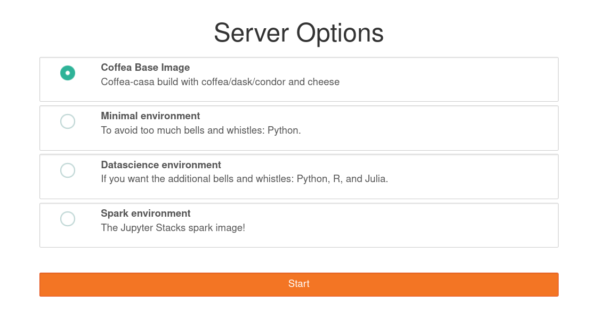
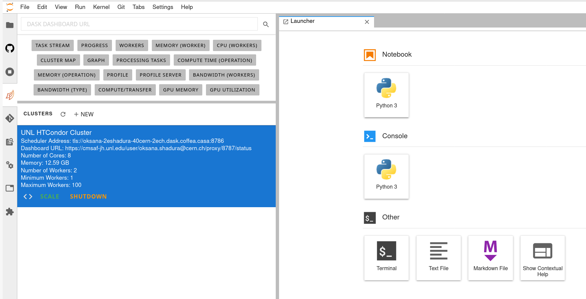

First Steps at CMS Coffea-Casa @ UNL
==========================
Prerequisites
-------------
The primary mode of analysis with coffea-casa is `coffea <https://coffeateam.github.io/coffea/index.html>`_. Coffea provides plenty of examples to users in its `documentation <https://coffeateam.github.io/coffea/examples.html>`_. Further resources, meant to run specifically on coffea-casa, can be found in the sidebar under the "Gallery of Coffea-casa Examples" section or the appropriate repository `here <https://github.com/CoffeaTeam/coffea-casa-tutorials>`_.

Knowledge of `Python <https://docs.python.org/3/tutorial/>`_ is assumed. The standard environment for coffea analyses is within `Jupyter Notebooks <https://jupyter.org/>`_, which allow for dynamic, block-by-block execution of code. Coffea-casa employs the `JupyterLab <https://jupyterlab.readthedocs.io/en/stable/user/interface.html>`_ interface. JupyterLab is designed for hosting Jupyter Notebooks on the web and permits the usage of additional features within its environment, including Git access, compatibility with cluster computing tools, and much, much more.

If you aren't familiar with any of these tools, please click on the links above and get acquainted with how they work before delving into coffea-casa.

Access
------

.. important::
   Please use `https://coffea.casa <https://coffea.casa>`_ as an access point to the CMS Coffea-Casa Analysis Facility @ T2 Nebraska.

.. image:: _static/coffea-casa-enter.png
   :alt: Access to Coffea-casa Analysis Facility @ T2 Nebraska
   :width: 50%
   :align: center

CMS AuthZ Authentication Instance
---------------------------------

Currently Coffea-Casa Analysis Facility @ T2 Nebraska support any member of CMS VO organisation.

To access it please sign in or sign up using ``Apply for an account``.

.. image:: _static/coffea-casa-authz-approval.png
   :alt: Approval required for CMS Authz authentification to Coffea-casa Analysis Facility @ T2 Nebraska
   :width: 50%
   :align: center

Docker Image Selection
----------------------

The default image is preloaded with *coffea*, *Dask*, and *HTCondor* and you should select it:

This will forward you to your own personal Jupyterhub instance running at Analysis Facility @ T2 Nebraska:

Cluster Resources in Coffea-Casa Analysis Facility @ T2 Nebraska
----------------------------------------------------------------

By default, the Coffea-casa Dask cluster should provide you with a scheduler and workers, which you can see by clicking on the colored Dask icon in the left sidebar.

.. image:: _static/coffea-casa-startr.png
   :alt: Default Dask Labextention powered cluster available Coffea-casa Analysis Facility @ T2 Nebraska
   :width: 50%
   :align: center

As soon as you will start your computations, you will notice that available resources at the Coffea-Casa Analysis Facility @ T2 Nebraska can easily autoscale depending on available resources in the HTCondor pool at Nebraska Tier 2.

.. image:: _static/coffea-casa-labext.png
   :alt: Autoscaling with Dask Labextention powered cluster available at Coffea-casa Analysis Facility @ T2 Nebraska
   :width: 50%
   :align: center
   

Opening a New Console or File
-----------------------------
There are three ways by which you can open a new tab within coffea-casa. Two are located within the **File** menu at the very top of the JupyterLab interface: *New* and *New Launcher.*

.. image:: _static/coffea-casa-newtab.png
   :alt: The File menu of the coffea-casa JupyterLab interface.
   :width: 50%
   :align: center
   
The *New* dropdown menu allows you to open the console or a file of a specified format directly. The *New Launcher* option creates a new tab with buttons that permit you to launch a console or a new file, exactly like the interface you are shown when you first open coffea-casa.

The final way is specific to the **File Browser** tab of the sidebar.

.. image:: _static/coffea-casa-newlauncher.png
   :alt: The File Browser tab of the coffea-casa JupyterLab interface, showcasing the New Launcher button.
   :width: 50%
   :align: center

This behaves exactly like the *New Launcher* option above.

.. note::

    Regardless of the method you use to open a new file, the file will be saved to the current directory of your **File Browser.**

Using Git
---------

Cloning a repository in the Coffea-casa Analysis Facility @ T2 Nebraska is simple, though it can be a little confusing because it is spread across two tabs in the sidebar: the *File Browser* and the *Git* tabs.

In order to clone a repository, first go to the Git tab. It should look like this:

.. image:: _static/git.png
   :alt: The Git tab at Coffea-casa Analysis Facility @ T2 Nebraska
   :width: 50%
   :align: center

Simply click the appropriate button (initialize a repository, or clone a repository) and you'll be hooked up to GitHub. This should then take you to the *File Browser* tab, which is where you can see all of the repositories you have cloned in your JupyterLab instance. The File Browser should look like this:

.. image:: _static/browser.png
   :alt: The File Browser tab at Coffea-casa Analysis Facility @ T2 Nebraska
   :width: 50%
   :align: center

If you wish to change repositories, simply click the folder button to enter the root directory. If you are in the root directory, the Git tab will reset and allow you to clone another repository.

If you wish to commit, push, or pull from the repository you currently have active in the File Browser, then you can return to the Git tab. It should change to look like this, so long as you have a repository open in the File Browser:

.. image:: _static/git2.png
   :alt: The Git tab at Coffea-casa Analysis Facility @ T2 Nebraska, after a repository is activated
   :width: 50%
   :align: center

The buttons in the top right allow for pulling and pushing respectively. When you have edited files in a directory, they will show up under the *Changed* category, at which point you can hit the **+** to add them to a commit (at which point they will show up under *Staged*). Filling out the box at the bottom of the sidebar will file your commit, and prepare it for you to push.

Using XCache
-------
When we use CMS data, we generally require certificates or we will be faced with authentication errors. Coffea-casa handles the issue of certificates internally through xcache tokens so that its users do not explicitly have to import their certificates, though this dynamic requires adjustiment of the redirector portion of the path to the root file requested. 

Let's say we wish to request the file:

.. code-block:: bash

    root://cmsxrootd.fnal.gov//store/data/Run2018A/DoubleMuon/NANOAOD/02Apr2020-v1/30000/0555868D-6B32-D249-9ED1-6B9A6AABDAF7.root

Then we would replace the ``cmsxrootd.fnal.gov`` redirector with the ``xcache`` redirector:

.. code-block:: bash

    root://xcache//store/data/Run2018A/DoubleMuon/NANOAOD/02Apr2020-v1/30000/0555868D-6B32-D249-9ED1-6B9A6AABDAF7.root
    
Now, we will be able to access our data.

In addition to handling authentication, XCache will cache files so that they are able to be pulled more quickly in subsequent runs of the analysis. It should be expected, then, that the first analysis run with a new coffea-casa file will run slower than ones which follow afterwards.

Example
-------
Now we will try to run a short example, using CMS data, which corresponds to plotting the `dimuon Z-peak <https://github.com/CoffeaTeam/coffea-casa-tutorials/blob/master/examples/zpeak_example.ipynb>`_. We use dimuon data which consists of ~3 million events at ~2.7 GB which belongs to the ``/DoubleMuon/Run2018A-02Apr2020-v1/NANOAOD`` dataset.

We import some common coffea libraries used in this example:

.. code-block:: python

    import numpy as np
    from coffea import hist
    from coffea.analysis_objects import JaggedCandidateArray
    import coffea.processor as processor
    %matplotlib inline
    
To select the aforementioned data in a coffea-friendly syntax, we employ a dictionary of datasets, where each dataset (key) corresponds to a list of files (values):

.. code-block:: python

    fileset = {'DoubleMu' : ['root://xcache//store/data/Run2018A/DoubleMuon/NANOAOD/02Apr2020-v1/30000/0555868D-6B32-D249-9ED1-6B9A6AABDAF7.root',
                            'root://xcache//store/data/Run2018A/DoubleMuon/NANOAOD/02Apr2020-v1/30000/07796DC0-9F65-F940-AAD1-FE82262B4B03.root',
                            'root://xcache//store/data/Run2018A/DoubleMuon/NANOAOD/02Apr2020-v1/30000/09BED5A5-E6CC-AC4E-9344-B60B3A186CFA.root']}

Coffea provides the coffea.processor module, where users may write their analysis code without worrying about the details of efficient parallelization, assuming that the parallelization is a trivial map-reduce operation (e.g., filling histograms and adding them together).

.. code-block:: python

    class Processor(processor.ProcessorABC):
    def __init__(self):
        dataset_axis = hist.Cat("dataset", "Dataset")
        dimu_mass_axis = hist.Bin("dimu_mass", "$\mu\mu$ Mass [GeV]", 50, 20, 120)
        
        self._accumulator = processor.dict_accumulator({
            'dimu_mass': hist.Hist("Counts", dataset_axis, dimu_mass_axis),
        })
    
    @property
    def accumulator(self):
        return self._accumulator
    
    def process(self, events):
        output = self.accumulator.identity()
        
        dataset = events.metadata["dataset"]
        
        mu = events.Muon
        # Select events with 2 muons whose charges cancel out (Zs are charge-neutral).
        dimu_neutral = mu[(ak.num(mu) == 2) & (ak.sum(mu.charge, axis=1) == 0)]
        # Add together muon pair p4's, find dimuon mass.
        dimu_mass = (dimu_neutral[:, 0] + dimu_neutral[:, 1]).mass
        # Plot dimuon mass.
        output['dimu_mass'].fill(dataset=dataset, dimu_mass=dimu_mass)
        return output

    def postprocess(self, accumulator):
        return accumulator

With our data in our fileset variable and our processor ready to go, we simply need to connect to the Dask Labextention-powered cluster available within the Coffea-Casa Analysis Facility @ T2 Nebraska. This can be done by dragging the scheduler into the notebook, or by manually typing the following:

.. code-block:: python

    from dask.distributed import Client
    client = Client("tls://localhost:8786")

Then we bundle everything up to run our job, making use of the Dask executor. To do this, we must point to a client within executor_args.

.. code-block:: python

    executor = processor.DaskExecutor(client=client)
    run = processor.Runner(executor=executor,
                            schema=schemas.NanoAODSchema,
                          )

    output = run(fileset, "Events", processor_instance=Processor())

The final step is to generates a 1D histogram from the data output to the 'MET' key. fill_opts are optional arguments to fill the graph (default is a line).

.. code-block:: python

    hist.plot1d(output['dimu_mass'], overlay='dataset', fill_opts={'edgecolor': (0,0,0,0.3), 'alpha': 0.8})

As a result you should see next plot:

