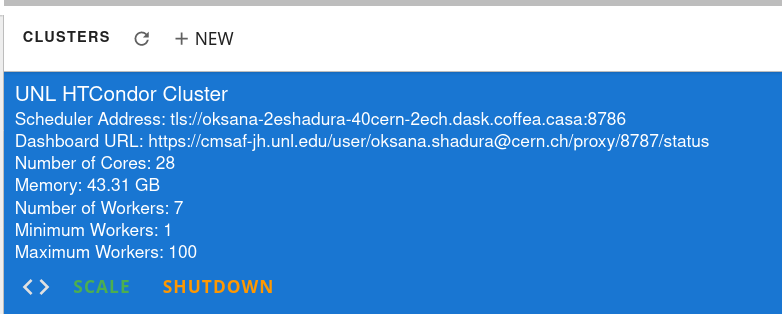

First steps at Coffea-casa
=========

Setup
-----

In this example, we'll try to run a simple analysis example at Coffea-Casa Analysis Facility and use  ``coffea_casa`` wrapper library that allowed to use pre-configured settings for HTCondor configuration and Dask scheduler and worker images.

Our goal of this `toy` analysis is to plot the missing *ET* of all events from dataset, converted from 2012 CMS Open Data (17 GB, 54 million events), available in public EOS (root://eospublic.cern.ch//eos/root-eos/benchmark/Run2012B_SingleMu.root)

Access
-----

Please use `this address <https://cmsaf-jh.unl.edu>`_ as an access point to Coffea-casa Analysis Facility @ T2 Nebraska.

Currently Coffea-casa Analysis Facility @ T2 Nebraska provide access to any member of CMS VO organisation.

CMS AuthZ Authentification Instance
-----

Currently Coffea-casa Analysis Facility @ T2 Nebraska support any member of CMS VO organisation.

To access it please sign in or sign up using ``Create account``

.. image:: _static/coffea-casa-authz.png
   :alt: CMS Authz authentification to Coffea-casa Analysis Facility @ T2 Nebraska
   :width: 50%
   :align: center

Docker image to be selected
-----

For high efficient analysis using *coffea* package, powered with *Dask* and *HTCondor* please select:

.. image:: _static/coffea-casa-image.png
    :alt:  Coffea Casa analysis image available at Coffea-casa Analysis Facility @ T2 Nebraska
    :width: 50%
    :align: center

After you will be forwarded to your personal Jupyterhub instance running at Analysis Facility @ T2 Nebraska:

.. image:: _static/coffea-casa-start.png
   :alt: Jupyterhub instance together with Dask Labextention powered cluster available at Coffea-casa Analysis Facility @ T2 Nebraska
   :width: 100%
   :align: center

Available resources Coffea-casa Analysis Facility @ T2 Nebraska
-----

Check if you have started your Coffea-Casa Dask Cluster  with the ``distributed`` scheduler and 2 Dask workers (first launched at Kubernetes cluster and other one directly available in HTCondor queue) on the cluster.

.. image:: _static/coffea-casa-startr.png
   :alt: Default Dask Labextention powered cluster available Coffea-casa Analysis Facility @ T2 Nebraska
   :width: 50%
   :align: center

As soon as you will start your computations, you will notice that available resources at Coffea-casa Analysis Facility @ T2 Nebraska can easily autoscale depending to available resources at HTCondor pool at Nebraska Tier 2.

Simple example
------------

Import  ``coffea`` libraries used in this example:

.. code-block:: python

    import numpy as np
    from coffea import hist
    from coffea.analysis_objects import JaggedCandidateArray
    import coffea.processor as processor
    %matplotlib inline

Coffea provides the coffea.processor module, which allows users to worry just about the actual analysis code and not about how to implement efficient parallelization, assuming that the parallization is a trivial map-reduce operation (e.g. filling histograms and adding them together).

.. code-block:: python

    # This program plots an event-level variable (in this case, MET, but switching it is as easy as a dict-key change). It also demonstrates an easy use of the book-keeping cutflow tool, to keep track of the number of events processed.
    # The processor class bundles our data analysis together while giving us some helpful tools.  It also leaves looping and chunks to the framework instead of us.
    class Processor(processor.ProcessorABC):
      def __init__(self):
          # Bins and categories for the histogram are defined here. For format, see https://coffeateam.github.io/coffea/stubs/coffea.hist.hist_tools.Hist.html && https://coffeateam.github.io/coffea/stubs/coffea.hist.hist_tools.Bin.html
          dataset_axis = hist.Cat("dataset", "")
          MET_axis = hist.Bin("MET", "MET [GeV]", 50, 0, 100)

          # The accumulator keeps our data chunks together for histogramming. It also gives us cutflow, which can be used to keep track of data.
          self._accumulator = processor.dict_accumulator({
              'MET': hist.Hist("Counts", dataset_axis, MET_axis),
              'cutflow': processor.defaultdict_accumulator(int)
              })

      @property
      def accumulator(self):
        return self._accumulator

      def process(self, events):
        output = self.accumulator.identity()

        # This is where we do our actual analysis. The dataset has columns similar to the TTree's; events.columns can tell you them, or events.[object].columns for deeper depth.
        dataset = events.metadata["dataset"]
        MET = events.MET.pt

        # We can define a new key for cutflow (in this case 'all events'). Then we can put values into it. We need += because it's per-chunk (demonstrated below)
        output['cutflow']['all events'] += MET.size
        output['cutflow']['number of chunks'] += 1

        # This fills our histogram once our data is collected. The hist key ('MET=') will be defined in the bin in __init__.
        output['MET'].fill(dataset=dataset, MET=MET.flatten())
        return output

      def postprocess(self, accumulator):
        return accumulator

Select `Run2012B_SingleMu.root` dataset converted from 2012 CMS Open Data (17 GB, 54 million events), available in public public EOS:

.. code-block:: python

    fileset = {'SingleMu' : ["root://eospublic.cern.ch//eos/root-eos/benchmark/Run2012B_SingleMu.root"]}

Simply connect to Dask Labextention powered cluster available Coffea-casa Analysis Facility @ T2 Nebraska:

.. code-block:: python

    from dask.distributed import Client
    client = Client("tls://localhost:8786")

Next step is to run a developed Processor() Coffea processor using uproot for data delivery and Dask executor:

.. code-block:: python

    output = processor.run_uproot_job(fileset=fileset,
                      treename="Events",
                      processor_instance=Processor(),
                      executor=processor.dask_executor,
                      executor_args={'client': client, 'nano': True},
                      chunksize=250000)

Final step is to generates a 1D histogram from the data output to the 'MET' key. fill_opts are optional, to fill the graph (default is a line).

.. code-block:: python

    hist.plot1d(output['MET'], overlay='dataset', fill_opts={'edgecolor': (0,0,0,0.3), 'alpha': 0.8})

As a result you should see next plot:

.. image:: _static/example1-plot.png
   :alt: Final plot that you should see at the end of example
   :width: 50%
   :align: center
