First Steps at Opendata Coffea-Casa @ UNL
==========================
Prerequisites
-------------
The primary mode of analysis with coffea-casa is `coffea <https://coffeateam.github.io/coffea/index.html>`_. Coffea provides plenty of examples to users in its `documentation <https://coffeateam.github.io/coffea/examples.html>`_. Further resources, meant to run specifically on coffea-casa, can be found in the sidebar under the "Gallery of Coffea-casa Examples" section or the appropriate repository `here <https://github.com/CoffeaTeam/coffea-casa-tutorials>`_.

Knowledge of `Python <https://docs.python.org/3/tutorial/>`_ is assumed. The standard environment for coffea analyses is within `Jupyter Notebooks <https://jupyter.org/>`_, which allow for dynamic, block-by-block execution of code. Coffea-casa employs the `JupyterLab <https://jupyterlab.readthedocs.io/en/stable/user/interface.html>`_ interface. JupyterLab is designed for hosting Jupyter Notebooks on the web and permits the usage of additional features within its environment, including Git access, compatibility with cluster computing tools, and much, much more.

If you aren't familiar with any of these tools, please click on the links above and get acquainted with how they work before delving into coffea-casa.

Access
------

.. important::
   Please use `https://coffea-opendata.casa <https://coffea-opendata.casa>`_ as an access point to the Opendata Coffea-Casa Analysis Facility @ T2 Nebraska.

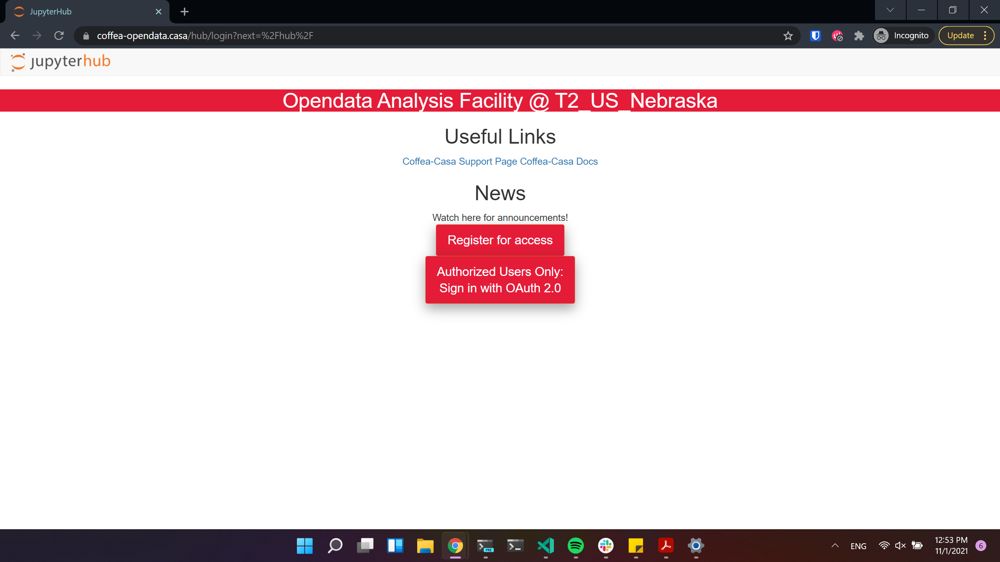

.. important::
   **Remember that to access this instance you need to register: click "Register for access".
   (We have limited resources available and can't provide access to everyone under CILogon).**

Opendata CILogon Authentication Instance
---------------------------------

Currently Opendata Coffea-Casa support any CILogon identity provider. Select your identity provider:

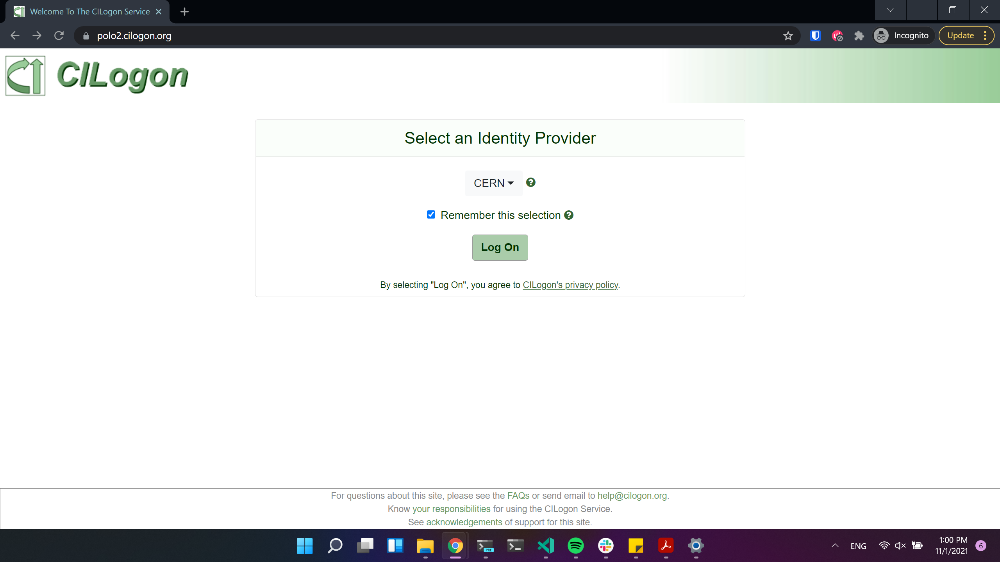

For accessing Opendata Coffea-Casa, we are offering a self-signup registration form with approval.

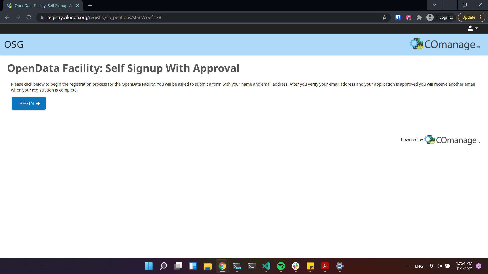

Click to proceed to next stage:

.. image:: _static/cc-reg2.png
   :alt: Check an information in the registration form (form should be already prefilled).
   :width: 50%
   :align: center

Click to proceed to the next stage:

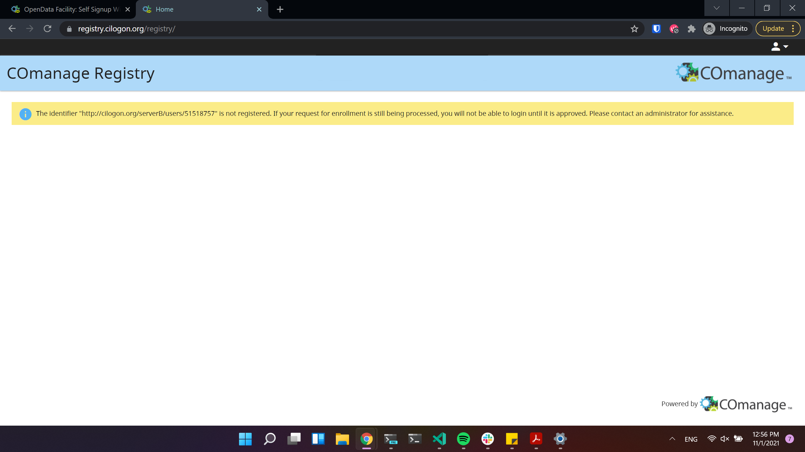

If you see the next window, it means that registration request was sent succesfully!

.. important::
   **After this staep please wait when you will get approved by administrator!**

After your request is approved, you will receive an email, where you will need simply to click a link:

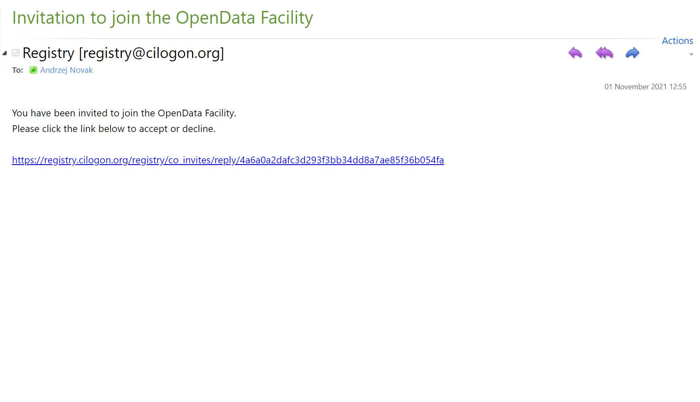

Voila! Now you can login to Opendata Coffea-Casa. Click on "Authorized Users Only: Sign in with OAuth 2.0":

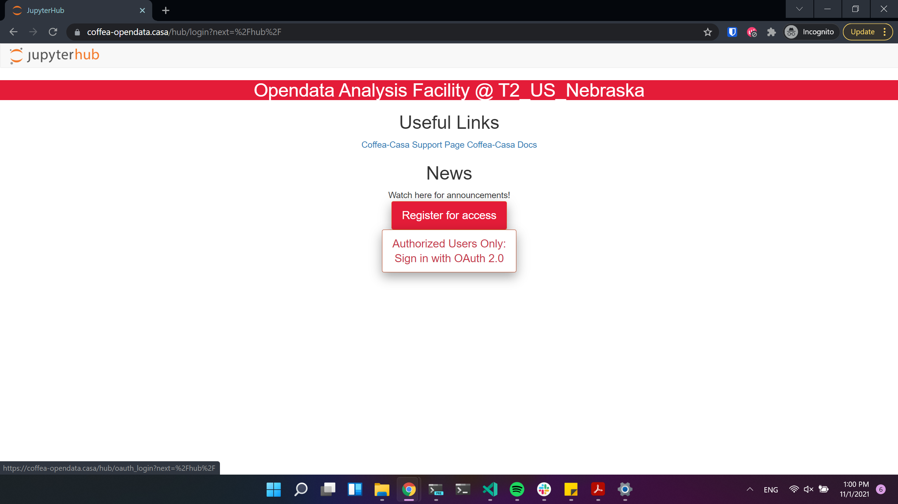

Docker Image Selection
----------------------

For high efficient analysis using *coffea* package, powered with *Dask* and *HTCondor* please select:

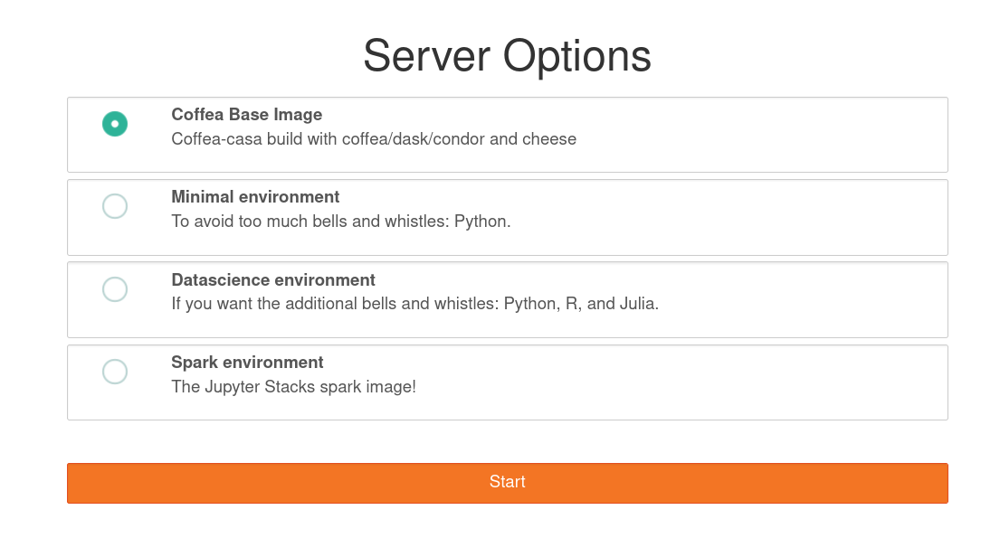

Then you will be forwarded to your personal Jupyterhub instance running at Analysis Facility @ T2 Nebraska:

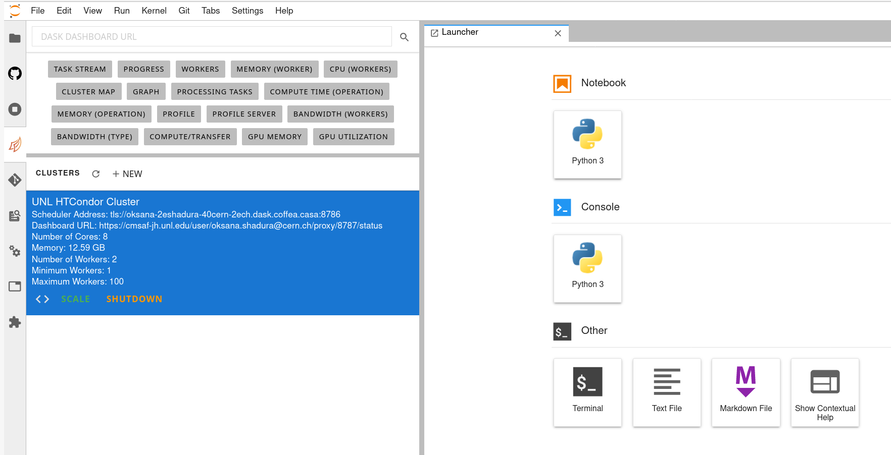

Cluster Resources in Opendata Coffea-Casa Analysis Facility @ T2 Nebraska
----------------------------------------------------------------

By default, the Coffea-casa Dask cluster should provide you with a scheduler and workers, which you can see by clicking on the colored Dask icon in the left sidebar.

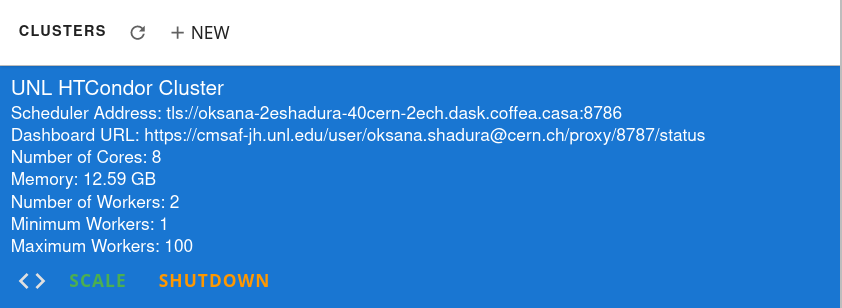

As soon as you start your computations, you will notice that available resources at the Opendata Coffea-Casa Analysis Facility @ T2 Nebraska can easily autoscale depending on available resources in the HTCondor pool at Nebraska Tier 2.

.. image:: _static/coffea-casa-labext.png
   :alt: Autoscaling with Dask Labextention powered cluster available at Opendata Coffea-casa Analysis Facility @ T2 Nebraska
   :width: 50%
   :align: center
   

Opening a New Console or File
-----------------------------
There are three ways by which you can open a new tab within coffea-casa. Two are located within the **File** menu at the very top of the JupyterLab interface: *New* and *New Launcher.*

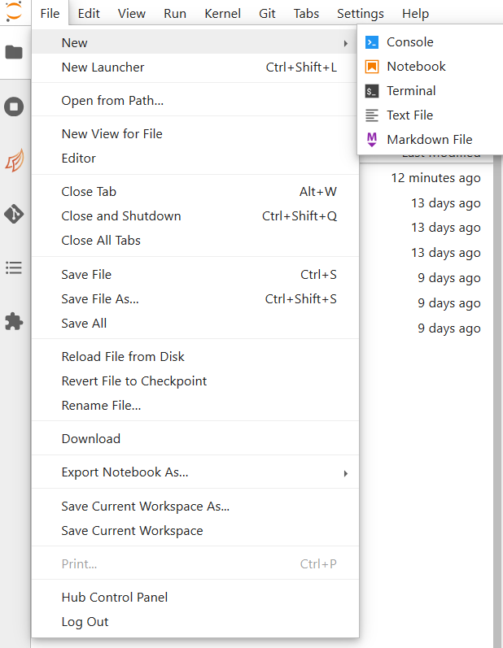
   
The *New* dropdown menu allows you to open the console or a file of a specified format directly. The *New Launcher* option creates a new tab with buttons that permit you to launch a console or a new file, exactly like the interface you are shown when you first open coffea-casa.

The final way is specific to the **File Browser** tab of the sidebar.

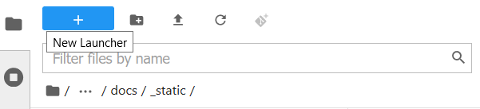

This behaves exactly like the *New Launcher* option above.

.. note::

    Regardless of the method you use to open a new file, the file will be saved to the current directory of your **File Browser.**

Using Git
---------

Cloning a repository in the Opendata Coffea-casa Analysis Facility @ T2 Nebraska is simple, though it can be a little confusing because it is spread across two tabs in the sidebar: the *File Browser* and the *Git* tabs.

In order to clone a repository, first go to the Git tab. It should look like this:

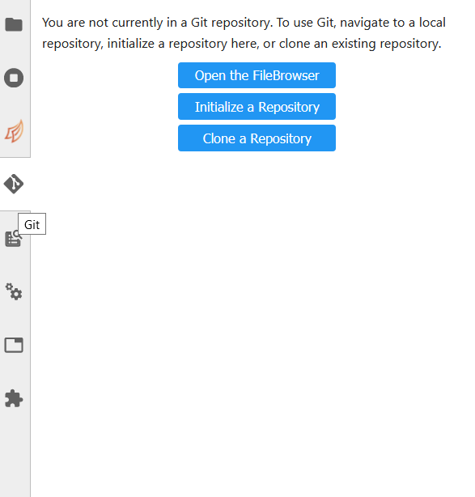

Simply click the appropriate button (initialize a repository, or clone a repository) and you'll be hooked up to GitHub. This should then take you to the *File Browser* tab, which is where you can see all of the repositories you have cloned in your JupyterLab instance. The File Browser should look like this:

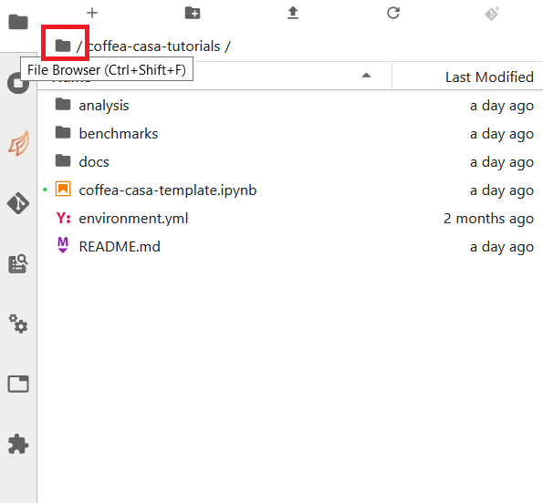

If you wish to change repositories, simply click the folder button to enter the root directory. If you are in the root directory, the Git tab will reset and allow you to clone another repository.

If you wish to commit, push, or pull from the repository you currently have active in the File Browser, then you can return to the Git tab. It should change to look like this, so long as you have a repository open in the File Browser:

.. image:: _static/git2.png
   :alt: The Git tab at Opendata Coffea-casa Analysis Facility @ T2 Nebraska, after a repository is activated
   :width: 50%
   :align: center

The buttons in the top right allow for pulling and pushing respectively. When you have edited files in a directory, they will show up under the *Changed* category, at which point you can hit the **+** to add them to a commit (at which point they will show up under *Staged*). Filling out the box at the bottom of the sidebar will file your commit, and prepare it for you to push.

Example
-------
In this example (which corresponds to `ADL Benchmark 1 <https://github.com/CoffeaTeam/coffea-casa-tutorials/blob/master/examples/example1.ipynb>`_), we'll try to run a simple analysis example on the Coffea-Casa Analysis Facility. We will use the ``coffea_casa`` wrapper library, which allows use of pre-configured settings for HTCondor configuration and Dask scheduler/worker images.

Our goal in this `toy` analysis is to plot the missing transverse energy (*MET*) of all events from a sample dataset; this data was converted from 2012 CMS Open Data (17 GB, 54 million events), and is available in public EOS (root://eospublic.cern.ch//eos/root-eos/benchmark/Run2012B_SingleMu.root).

First, we need to import the ``coffea`` libraries used in this example:

.. code-block:: python

    import numpy as np
    from coffea import hist
    from coffea.analysis_objects import JaggedCandidateArray
    import coffea.processor as processor
    %matplotlib inline
    
To select the aforementioned data in a coffea-friendly syntax, we employ a dictionary of datasets, where each dataset (key) corresponds to a list of files (values):

.. code-block:: python

    fileset = {'SingleMu' : ["root://eospublic.cern.ch//eos/root-eos/benchmark/Run2012B_SingleMu.root"]}

Coffea provides the coffea.processor module, where users may write their analysis code without worrying about the details of efficient parallelization, assuming that the parallelization is a trivial map-reduce operation (e.g., filling histograms and adding them together).

.. code-block:: python

    # This program plots an event-level variable (in this case, MET, but switching it is as easy as a dict-key change). It also demonstrates an easy use of the book-keeping cutflow tool, to keep track of the number of events processed.
    # The processor class bundles our data analysis together while giving us some helpful tools.  It also leaves looping and chunks to the framework instead of us.
    class Processor(processor.ProcessorABC):
      def __init__(self):
          # Bins and categories for the histogram are defined here. For format, see https://coffeateam.github.io/coffea/stubs/coffea.hist.hist_tools.Hist.html && https://coffeateam.github.io/coffea/stubs/coffea.hist.hist_tools.Bin.html
          dataset_axis = hist.Cat("dataset", "")
          MET_axis = hist.Bin("MET", "MET [GeV]", 50, 0, 100)

          # The accumulator keeps our data chunks together for histogramming. It also gives us cutflow, which can be used to keep track of data.
          self._accumulator = processor.dict_accumulator({
              'MET': hist.Hist("Counts", dataset_axis, MET_axis),
              'cutflow': processor.defaultdict_accumulator(int)
              })

      @property
      def accumulator(self):
        return self._accumulator

      def process(self, events):
        output = self.accumulator.identity()

        # This is where we do our actual analysis. The dataset has columns similar to the TTree's; events.columns can tell you them, or events.[object].columns for deeper depth.
        dataset = events.metadata["dataset"]
        MET = events.MET.pt

        # We can define a new key for cutflow (in this case 'all events'). Then we can put values into it. We need += because it's per-chunk (demonstrated below)
        output['cutflow']['all events'] += MET.size
        output['cutflow']['number of chunks'] += 1

        # This fills our histogram once our data is collected. The hist key ('MET=') will be defined in the bin in __init__.
        output['MET'].fill(dataset=dataset, MET=MET.flatten())
        return output

      def postprocess(self, accumulator):
        return accumulator

With our data in our fileset variable and our processor ready to go, we simply need to connect to the Dask Labextention-powered cluster available within the Coffea-Casa Analysis Facility @ T2 Nebraska. This can be done by dragging the scheduler into the notebook, or by manually typing the following:

.. code-block:: python

    from dask.distributed import Client
    client = Client("tls://localhost:8786")

Then we bundle everything up to run our job, making use of the Dask executor. To do this, we must point to a client within executor_args.

.. code-block:: python

    executor = processor.DaskExecutor(client=client)
    run = processor.Runner(executor=executor,
                            schema=schemas.NanoAODSchema,
                            savemetrics=True
                          )

    output, metrics = run(fileset, "Events", processor_instance=Processor())

The final step is to generates a 1D histogram from the data output to the 'MET' key. fill_opts are optional arguments to fill the graph (default is a line).

.. code-block:: python

    hist.plot1d(output['MET'], overlay='dataset', fill_opts={'edgecolor': (0,0,0,0.3), 'alpha': 0.8})

As a result you should see next plot:

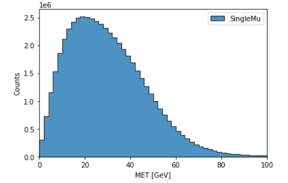
