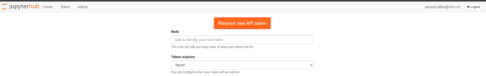
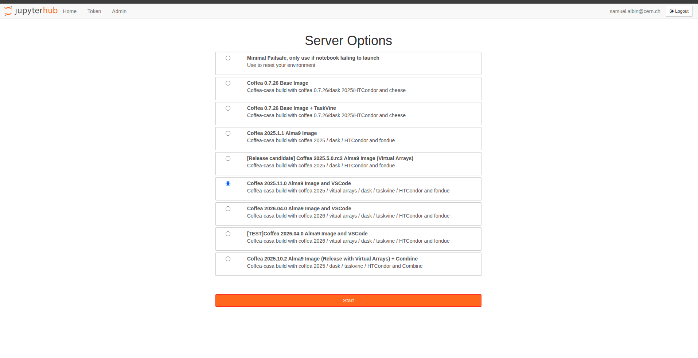
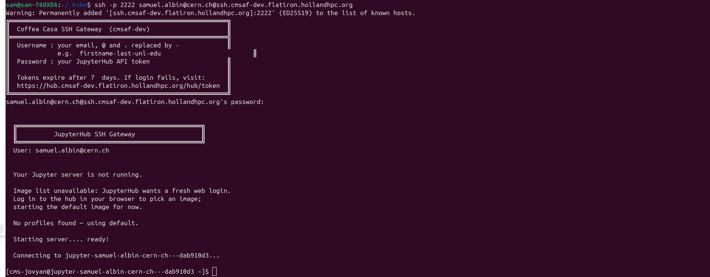

SSH Access to Coffea-Casa @ UNL
===============================

Coffea-casa provides an SSH gateway that lets you open a terminal directly
inside your Jupyter session from your own machine — no browser required once
you have a token. You authenticate with your **JupyterHub API token** as the
SSH password, pick a server image if your session isn't already running, and
land in a bash shell inside your coffea-casa pod (the same filesystem and
environment you see in JupyterLab).

Endpoints
---------

.. list-table::
   :header-rows: 1
   :widths: 15 45 40

   * - Instance
     - SSH endpoint
     - Get your token at
   * - Production (``coffea.casa``)
     - ``ssh.cmsaf-prod.flatiron.hollandhpc.org``, port ``2222``
     - `https://coffea.casa/hub/token <https://coffea.casa/hub/token>`_
   * - Development
     - ``ssh.cmsaf-dev.flatiron.hollandhpc.org``, port ``2222``
     - `https://hub.cmsaf-dev.flatiron.hollandhpc.org/hub/token <https://hub.cmsaf-dev.flatiron.hollandhpc.org/hub/token>`_

Your username
-------------

Your SSH username is the e-mail address you log in to coffea-casa with, in
one of two equivalent forms:

* your plain e-mail, e.g. ``firstname.lastname@unl.edu``
* the e-mail with ``@`` and ``.`` replaced by ``-``, e.g. ``firstname-lastname-unl-edu``

All of these work:

.. code-block:: bash

   ssh -p 2222 firstname-lastname-unl-edu@ssh.cmsaf-prod.flatiron.hollandhpc.org
   ssh -p 2222 firstname.lastname@unl.edu@ssh.cmsaf-prod.flatiron.hollandhpc.org
   ssh -p 2222 -l firstname.lastname@unl.edu ssh.cmsaf-prod.flatiron.hollandhpc.org

(SSH splits ``user@host`` at the *last* ``@``, so the double-``@`` form is
fine.)

.. important::
   Use the account you got your token from. If you log in to the hub with
   more than one identity provider (e.g. a ``@unl.edu`` and a ``@cern.ch``
   account), each is a separate user — check the e-mail shown in the top
   right of the hub page, and use that one as your SSH username.

Your password: a JupyterHub API token
-------------------------------------

The SSH password is **not** your institutional password — it is an API token
issued by the coffea-casa JupyterHub. To get one:

1. Log in to the hub in your browser (`https://coffea.casa <https://coffea.casa>`_
   for production) and open the **Token** page from the top navigation bar,
   or go directly to the token URL for your instance from the table above.
2. Optionally give the token a note (e.g. ``ssh``) so you can recognize it
   later, then click **Request new API token**.
3. Copy the token that appears and use it as your SSH password.

.. important::
   **Tokens are accepted for 7 days.** Regardless of the "Token expires"
   setting on the token page, the SSH gateway only accepts tokens *created*
   within the last 7 days, and older tokens are cleaned up nightly. If your
   login stops working, simply request a fresh token.

Connecting
----------

.. code-block:: bash

   $ ssh -p 2222 firstname-lastname-unl-edu@ssh.cmsaf-prod.flatiron.hollandhpc.org
   password: <paste your API token>

If your Jupyter server is **already running** (for example, you have
JupyterLab open in a browser tab), you'll be connected straight into it —
your SSH shell and your notebooks share the same pod, filesystem, and
environment.

If your server is **not running**, the gateway offers the same list of
server images you would see on the hub's "Server Options" page:

It then starts your selection and drops you into a shell inside it:

.. note::
   The image list is only available when you have logged in to the hub in
   your browser recently. If the gateway prints *"Image list unavailable:
   JupyterHub wants a fresh web login"*, it will start the **default** image
   instead — log in to the hub in your browser first if you want to pick a
   specific image over SSH (or start the desired image from the browser and
   then connect).

Stopping your server
--------------------

Your Jupyter server keeps running (and holding its resources) after you
close the SSH session. To stop it, either:

* **Over SSH** — reconnect to the gateway; when your server is running the
  menu offers:

  .. code-block:: text

     [1]  Connect to running server
     [2]  Stop server and restart with a new image
     [3]  Stop server and disconnect

  Choose ``3`` to stop it (or ``2`` to restart with a different image).

* **In the browser** — from JupyterLab go to *File → Hub Control Panel →
  Stop My Server*, or visit the hub home page and click **Stop My Server**.

Troubleshooting
---------------

* **"Permission denied"** — request a fresh API token from the token page
  (tokens older than 7 days are rejected), double-check the username form,
  and make sure you're pasting the token as the password with no extra
  whitespace.
* **The image picker doesn't appear** — see the note above: log in to the
  hub in your browser first, then reconnect.
* **File transfer** — the gateway provides an interactive shell only; use
  the JupyterLab interface (drag & drop, or the file browser) to move files
  in and out of your session.
* Still stuck? See :doc:`cc_support`.
