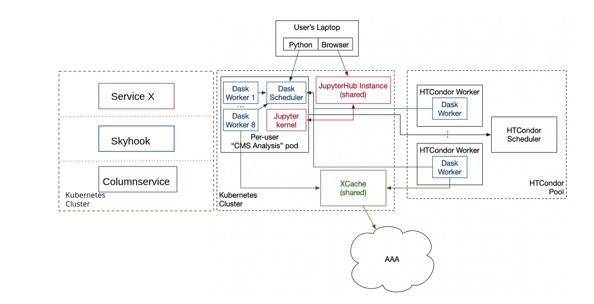
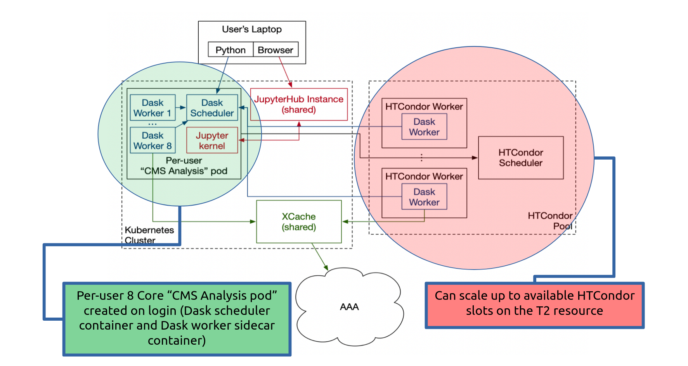

.. _index:

.. py:currentmodule:: coffea_casa

Welcome to the Coffea-Casa Project!
==============================================================================================================

**Coffea-casa** is a prototype of an analysis facility that provides services for “low latency columnar analysis,” enabling rapid processing of data in a column-wise fashion.

Coffea-casa Analysis Facility (AF) services, based on *Dask* and *Jupyter Notebook* technologies, aim to dramatically lower time for analysis and provide an easily-scalable and user-friendly computational environment that will simplify, facilitate, and accelerate the delivery of HEP results.

The facility is built on top of a Kubernetes cluster and integrates with dedicated resources, with resources allocated via fair share through the local HTCondor system and Nebraska Tier-2.

.. note::

    **Coffea-casa** is a prototype and is currently in active development: if you had noticed a bug or would like to leave us feedback,
    we invite you to open an issue directly on GitHub: <https://github.com/CoffeaTeam/coffea-casa/issues>

.. toctree::
   :maxdepth: 1
   :hidden:
   :caption: Getting Started

   Why Dask? <https://docs.dask.org/en/latest/why.html>
   Dask-jobqueue introduction <https://jobqueue.dask.org/en/latest/howitworks.html>
   Dask-labextention introduction <https://pypi.org/project/dask-labextension/>
   Coffea Documentation <https://coffeateam.github.io/coffea/>

.. toctree::
   :maxdepth: 1
   :hidden:
   :caption: How To Use Coffea-casa

   cc_user.rst
   cc_user_ssl.rst
   cc_packages.rst
   cc_metrics.rst
   cc_condor.rst
   cc_issues.rst

.. toctree::
   :maxdepth: 1
   :hidden:
   :caption: Gallery of Coffea-casa Examples

   Coffea-Casa Template <https://github.com/CoffeaTeam/coffea-casa/blob/master/docs/gallery/coffea-casa-template.ipynb>
   Coffea-Casa Analysis Tutorial <https://github.com/CoffeaTeam/coffea-casa/blob/master/docs/gallery/analysis_tutorial.ipynb>
   ADL Benchmark 1 <https://github.com/CoffeaTeam/coffea-casa/blob/master/docs/gallery/example1.ipynb>
   ADL Benchmark 2 <https://github.com/CoffeaTeam/coffea-casa/blob/master/docs/gallery/example2.ipynb>
   ADL Benchmark 3 <https://github.com/CoffeaTeam/coffea-casa/blob/master/docs/gallery/example3.ipynb>
   ADL Benchmark 4 <https://github.com/CoffeaTeam/coffea-casa/blob/master/docs/gallery/example4.ipynb>
   ADL Benchmark 5 <https://github.com/CoffeaTeam/coffea-casa/blob/master/docs/gallery/example5.ipynb>
   ADL Benchmark 6 <https://github.com/CoffeaTeam/coffea-casa/blob/master/docs/gallery/example6.ipynb>
   ADL Benchmark 7 <https://github.com/CoffeaTeam/coffea-casa/blob/master/docs/gallery/example7.ipynb>
   ADL Benchmark 8 <https://github.com/CoffeaTeam/coffea-casa/blob/master/docs/gallery/example8.ipynb>
   Single Top-Higgs Production (tHq) Analysis <https://github.com/CoffeaTeam/coffea-casa/blob/master/docs/gallery/analysis-casa.ipynb>
   Single Top-Higgs Production (tHq) Analysis Tutorial <https://github.com/CoffeaTeam/coffea-casa/blob/master/docs/gallery/analysis_tutorial.ipynb>
   Coffea + Dask + ServiceX Example <https://github.com/CoffeaTeam/coffea-casa/blob/master/docs/gallery/ttbar_HT.ipynb>

.. toctree::
  :maxdepth: 1
  :hidden:
  :caption: Deeper Look Into ``Coffea-Casa`` Internals

  cc_setup.rst
  cc_configuration.rst

.. toctree::
   :maxdepth: 1
   :hidden:
   :caption: Deploying Coffea-Casa at K8s Cluster

   cc_deployment.rst

.. toctree::
   :maxdepth: 1
   :hidden:
   :caption: Detailed Information on Coffea-Casa

   cc_api.rst

.. toctree::
   :maxdepth: 1
   :hidden:
   :caption: Support & Help

   cc_support.rst
